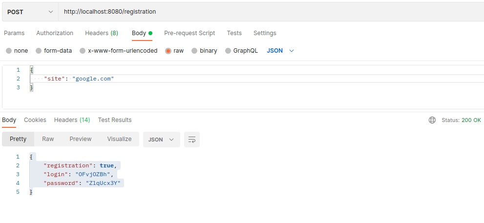
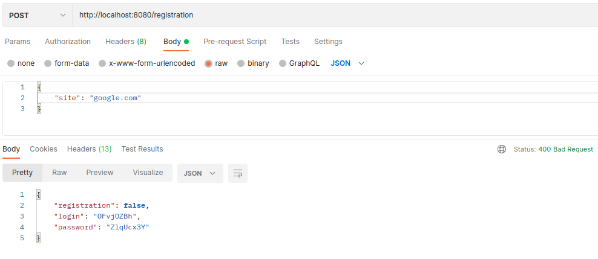
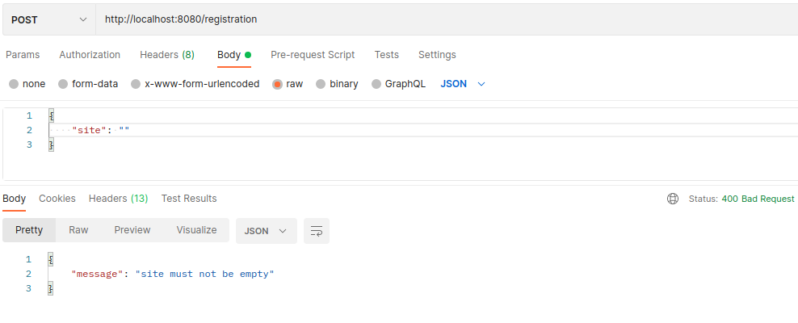
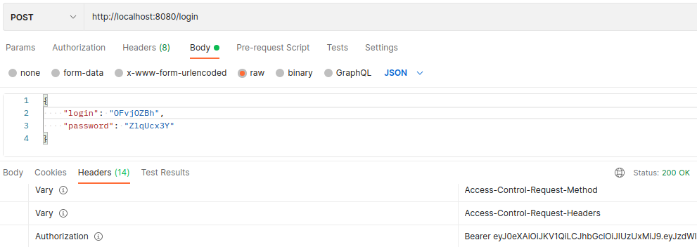
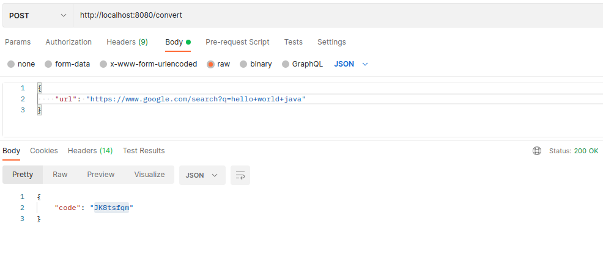
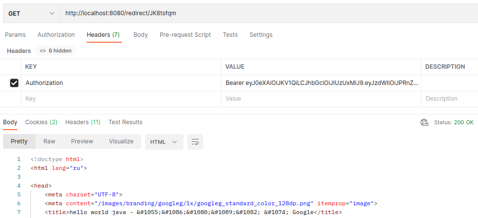
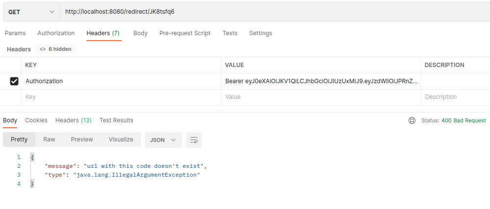
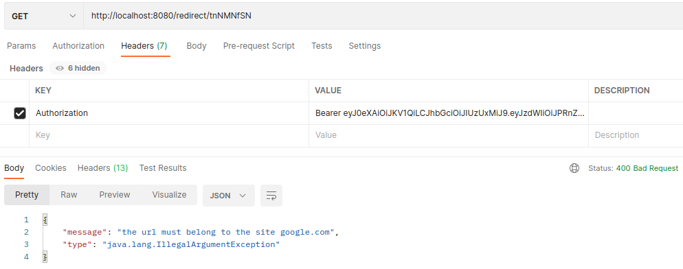
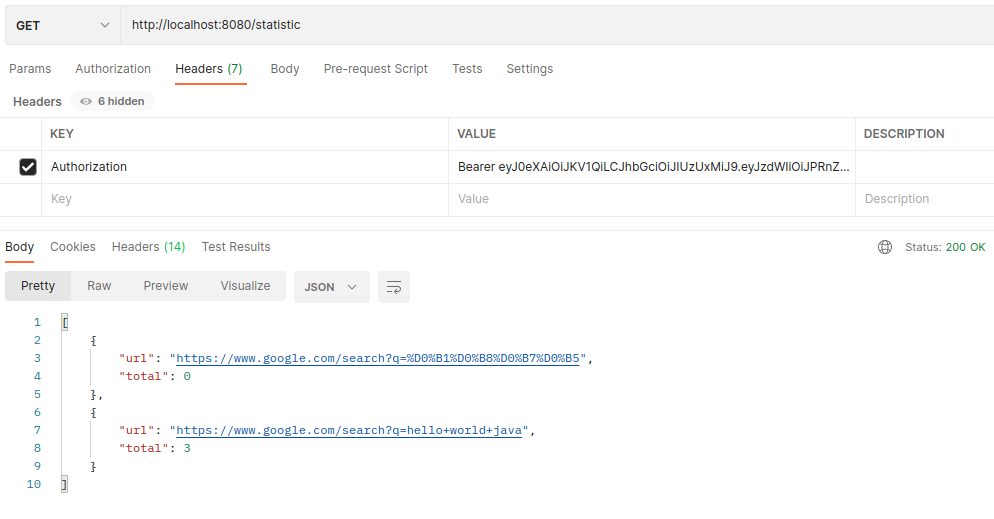

# job4j_url_shortcut

Чтобы обеспечить безопасность пользователей, все ссылки на сайте заменяются ссылками на наш сервис.  
Сервисом могут пользоваться разные сайты. Каждому сайту выдается пара - пароль и логин.  
Сайт регистрируется в системе.  
При авторизации получает JWT-токен.  
После чего сайт может регистрировать свои url-адреса взамен получая уникальные коды, использую которые можно перейти
по зарегистрированным url-адресам.  
Можно получить статистику, сколько раз переходили по определенным url-адресам.  
Сервис работает через REST API.  
 

Используются следующие технологии:
 - Java
 - SpringBoot
 - Spring Security
 - Spring Data
 - REST
 - JWT
 - PostgreSQL
 - Hibernate
 - Maven
 - Travis CI

Интерфейс проекта

